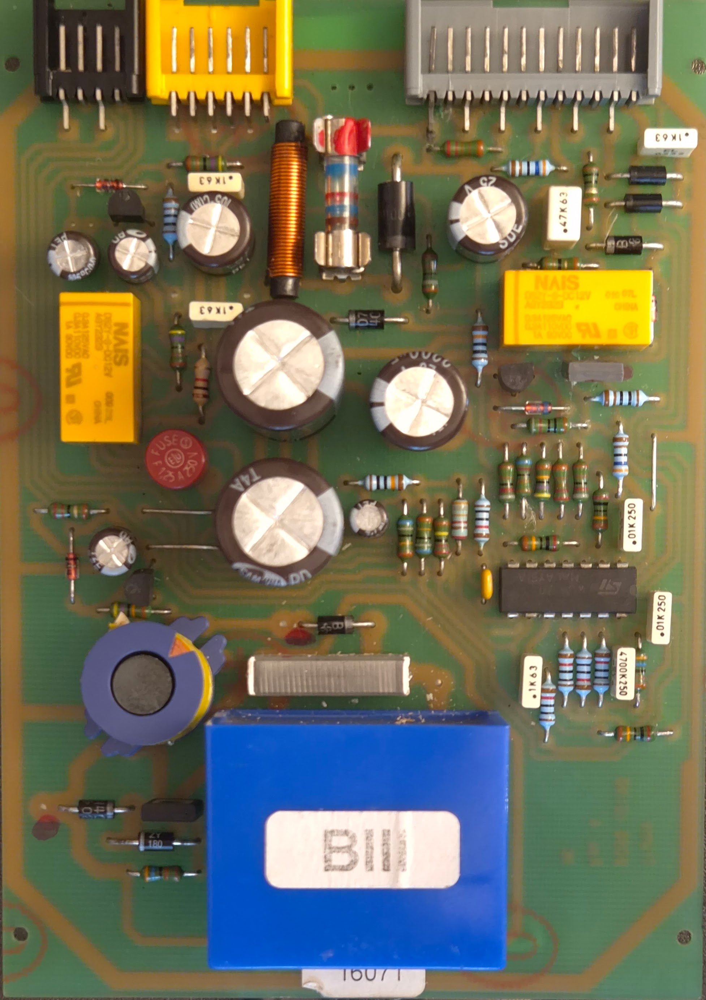
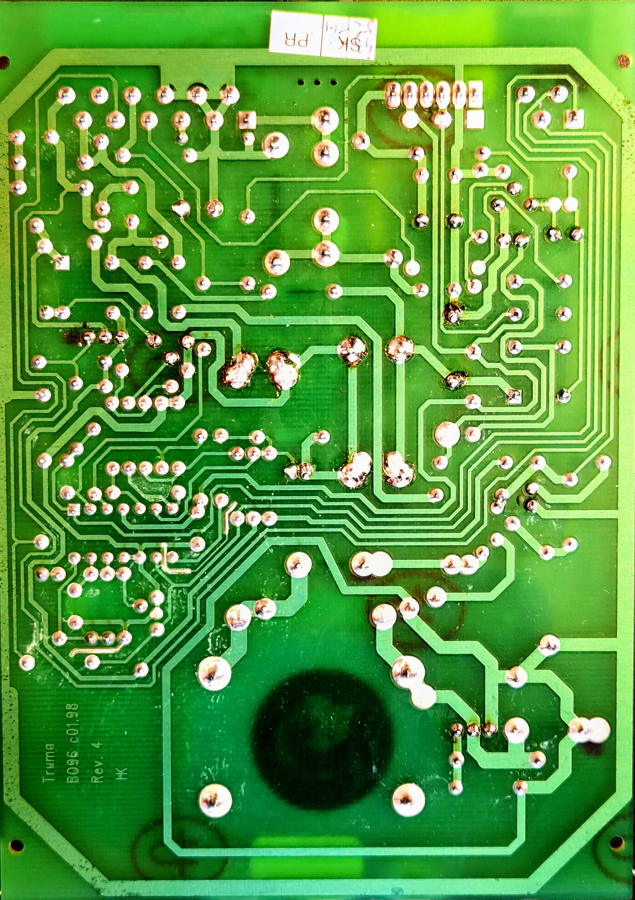
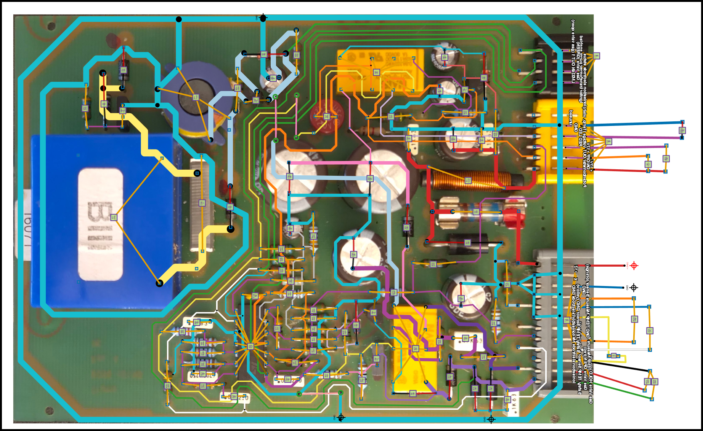

# Truma B10 Gas Water Heater Documentation

This repository provides detailed documentation, high-resolution PCB images, and analysis of the **Truma B10** (10-liter gas boiler), a classic water heater used in caravans and motorhomes.

Open this directory with:

https://pcbtracer.com/app.html

## Truma B10 Rev 4 Control Board

The **Truma B10 Rev 4** control board (often marked **B096 c01.98 Rev 4**) was built around **1998** (late 1990s to early 2000s).  
Units equipped with this revision were commonly produced and installed from ~1998 into the mid-2000s.

Key details:
- Date code `c01.98` refers to January 1998 (board design/finalization).
- Production year can be decoded from the boiler's type plate serial number (first two digits minus 11 = year).

## Images

## Status

* All importatnt components have been added with "pcb tracer"
* The property values like resistance haven't been assigned
* Connections are visually correct but the connections aren't done properly so the export to KiCad schema file won't work

The value is that one can know where to take meassurements and where not.

For instance, don't measure anything near the big blue box at the bottom and don't touch it either.

## Contents

- High-resolution scans of the PCB (top and bottom)
- Component identification
- Signal tracing and functional block diagrams
- Explanation of inner workings: power supply, ignition control, temperature regulation, and safety circuits
- Repair notes and common failure modes

The goal of this project is to preserve technical knowledge of the Truma B10 and support owners, technicians, and enthusiasts with repairs and understanding of this discontinued unit.

---

Contributions, additional photos, or corrections are welcome!

## Other resources

Different board but basically very good information.

https://www.youtube.com/watch?v=i9w5oOKL_Zs

# Experiments

If you build a HiL setup you need:

From the grey connector:
- Connect 12V (pin 1) and GND (pin 3)
- Connect pin 4 and 8 with a resistor (emulates temperature reading)
- Connect 5 and 9 somehow
- Connect 11 via 8 resistor ohm to 12V
- Connect 12 via 150 ohm resistor to 12V

The yellow connector:
- Connect pin 6 and pin 5 via a switch (always on won't work)
- Connect pin 6 and pin 4 (max temperature is +12V)

The black connector:
- This is only a debugging interface

## Closing the switch

## License

This documentation is licensed under the Creative Commons Attribution 4.0 International License. You are free to share and adapt the material for any purpose, even commercially, as long as appropriate credit is given, and any changes made are noted. To view a copy of this license, visit [http://creativecommons.org/licenses/by/4.0/](http://creativecommons.org/licenses/by/4.0/).

